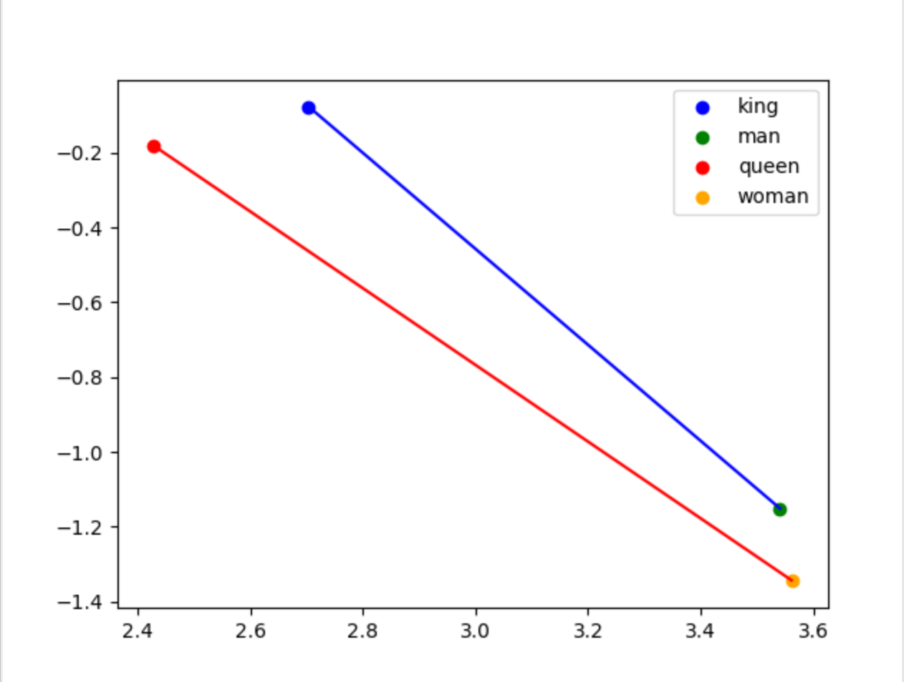

# kmwq

king - man = queen - woman

=> king - man + woman = queen

## Quickstart
1. Setup a virtualenv then `pip install -r requirements.txt`
2. You'll need to download the `en_vectors_web_lg` spacy models package.
You can do this with `spacy download en_vectors_web_lg` with your virtualenv
activated.
